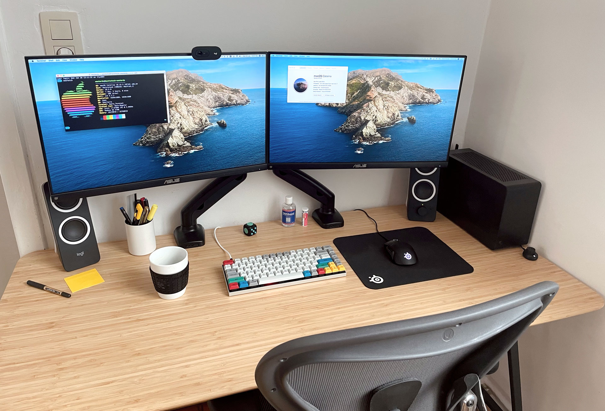

# Hackintosh

Powerfull Mini-ITX Hackintosh system

## Hardware

- **Case:** DAN A4-SFX
- **Power supply:** Corsair SF750 80 PLUS Platinum
- **Motherboard:** GIGABYTE GA-Z170N-WIFI (rev. 1.0)
- **Processor:** Intel Core i7 6700K
- **Memory:**
  - Crucial Ballistix Sport LT 16GB DDR4 3200MHz
  - Crucial Ballistix Sport LT 16GB DDR4 3200MHz
- **Video card:** AMD Radeon RX 5700 8GB
- **Network card:** Dell DW1560 Broadcom BCM94352Z M.2
- **Storage:**
  - Western Digital WD Blue 3D NAND 1TB SSD
  - Western Digital WD Blue 3D NAND 2TB SSD

## Resources

- https://hackintosh.gitbook.io
- https://hackintosher.com/guides
- https://reddit.com/r/hackintosh
- https://youtu.be/fA9AotXqkqA
